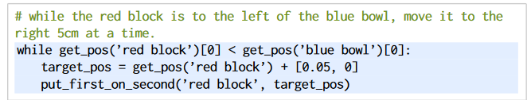
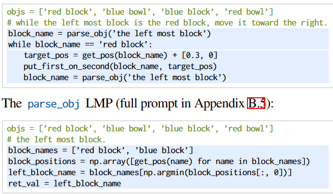
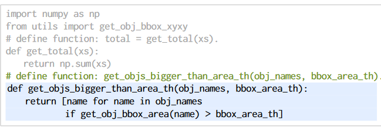
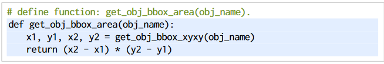
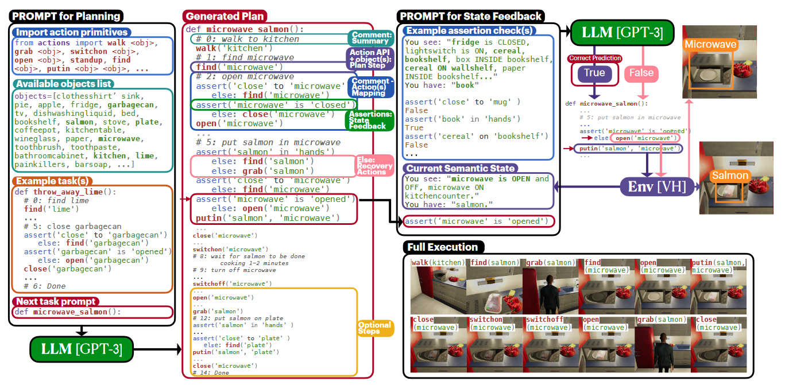

# Summary Literature Reivew (Attack on LLMs Planning)

## Prompt Planning
### Pythonic programmatic Prompt Planning (Few shot)
 Code as Policies: Language Model Programs for Embodied Control (IEEE, 2023)

**Main point:** 
This paper describes the use of LLMs to transform natural language into policy code that the system can compile and run directly. Secondly, it improves the reasoning ability and accuracy of the code generation model by proposing a method to hierarchically generate functions. Thirdly, a benchmark for evaluating language models in the context of robotic code generation is provided.Fourthly, it is shown that CaP improves metrics of generalisation, following the law that larger models perform better.

**Methods:** 
LMPs are few-shot prompted with examples to generate different subprograms that may process object detection results, build trajectories, or sequence control primitives. LMPs can be generated hierarchically by composing known functions (e.g., get_obj_names() using perception modules) or invoking other LMPs to define undefined functions.

Combining control flows, LMP composition, and hierarchical function generation.

1.   

2.  

3. 
 

**Pros:** 

1. The policy code and API parameters can be adapted to new natural language instructions; 
2. Can generalize to new objects and environments by bootstrapping off of open-vocabulary perception systems and/or saliency models. 
3. Don't need any additional data collection or model training. 
4. supporting instructions with non-English languages or emojis. 
5. The generated code strategy is directly compilable and executable

**Cons:** 

1. The Perception API has limited descriptive capabilities, e.g., it cannot describe the smoothness of a trajectory, the shape of a path. 
2. The available control primitives are limited. 
3. Inadequate ability to understand complex instructions 
4. Cannot perform 3D construction tasks. 
5. Assuming all instructions are feasible. 

 PROGPROMPT: Generating Situated Robot Task Plans using Large Language Models (IEEE, 2023)

**Main point:** 
The paper proposed a prompting approach and assertion environment feedback mechanism that combines natural language descriptions and program forms on LLMs, which allows robots to generate sequences of operations that can be directly executed without extensive training.

**Methods:** 
PROGPROMPT makes use of programming language constructs combined with a few-shot with natural language annotations to enumerate all the objects in the environment and all the actions that the robot can perform to prompt for a sequence of operations that can be directly executed in code form, and it also incorporates a closed-loop assertion check to get feedback on the environment and perform The closed-loop assertion check is also included to get feedback from the environment and to recover from the operation. 

**Pros:** 
1. The precondition checking helps recover from some failure modes. 
2. ProgPrompt enables LLMs to intelligently combine the robot capabilities with the environment and their own reasoning ability to generate an executable and valid task plan. 

**Cons:** 
1. All objects and actions need to be defined in advance. 
2. API-based access to these recent LLMs only allows textual queries. 
3. Plan generation does not take into account the low-level continuity of the actual environment state, but only plans and precondition checks based on the semantic state. 